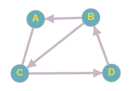

# Zkušební úloha

Cílem této zkušební úlohy je vyzkoušet si odevzdávací systém CodeCritic,
který automatizovaně spouští a vyhodnocuje výsledky odevzdaných programů.

Úloha, kterou má program řešit, na vstupu načte čísla `M` a `N`.
Čísla `M` a `N` určují velikost matice sousednosti, která se nachází dále na standartním vstupu.

Matice na vstupu reprezentuje orientovaný graf `G`. Vaším úkolem je transponovat graf `G`.
(To znamená, že pokud graf `G` obsahuje hranu `(u, v)` potom transponovaný graf `G'` obsahuje hranu `(v, u)`.

Program poté vypíše graf `G'` a to tak, že na `i`-tém řádku bude  vrchol `i` a pak všechny vrcholy, do kterých z vrcholu `i` existuje hrana.

Vrcholy jsou značeny písmeny `A, B, C, ...`


## Ukázka vstupu
```
4 4
0 0 1 0
1 0 1 0
1 0 0 1
0 1 0 0
```




## Ukázka výstupu
```
A: B C
B: D
C: A B
D: C
```

*V případě jakýkoliv nejasností, piště na stream našeho Google Classroom*