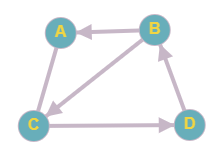

# Transponovaný graf (zkušební úloha)

Cílem této zkušební úlohy je vyzkoušet si odevzdávací systém CodeCritic,
který automatizovaně spouští a vyhodnocuje výsledky odevzdaných programů.

Vaším cílem je implementovat načtení matice sousednosti, sestavení transponovaného grafu a zápis v řídkém formátu.
Na vstupu jsou na prvním řádku jsou čísla `M` a `N`. 
Čísla `M` a `N` určují velikost matice sousednosti, která se nachází dále na standartním vstupu.

Matice na vstupu reprezentuje orientovaný graf `G`. Vaším úkolem je sestavit transponovaný graf `G'`.
(To znamená, že pokud graf `G` obsahuje hranu `(u, v)` potom transponovaný graf `G'` obsahuje hranu `(v, u)`.

Program poté vypíše graf `G'` v řídkém formátu. Konkrétně na  `i`-tém řádku bude  vrchol `i` a pak všechny vrcholy, do kterých z vrcholu `i` existuje hrana.

Vrcholy na výstupu budou označeny písmeny `A, B, C, ...`


## Ukázka vstupu
```
4 4
0 0 1 0
1 0 1 0
1 0 0 1
0 1 0 0
```



## Ukázka výstupu
```
A: B C
B: D
C: A B
D: C
```


